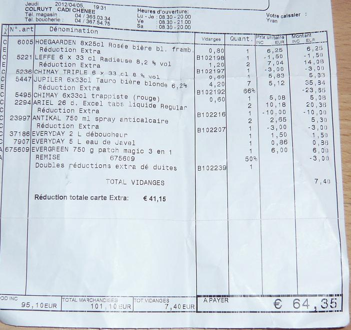
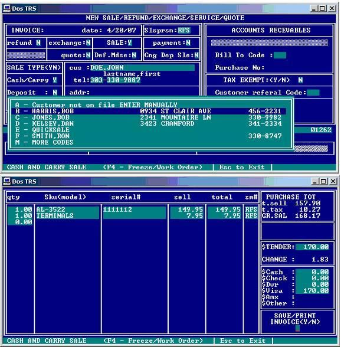

\cleardoublepage

# Recherches

Des tickets de plusieurs enseignes ont été récupérés pour servir d'inspiration.
Voir figure \ref{fig-ticket-match} et \ref{fig-ticket}.




L'interface utilisateur est basé sur le design des applications de bureau de la fin des années 80 / début des années 90.
Voir figure \ref{fig-interface}.
Les raccourcis clavier sont basés sur ceux de VI.



\cleardoublepage

# Fonctionnement du programme

L'application est divisée en une serie de d'interfaces qui s'appellent entre elles (figure \ref{fig-flowchart})


Les interfaces, la logique et les données manipulées par ces derniers ont été divisées à l'aide du design pattern MVVM (Model, View, View Model) (figure \ref{fig-modele})


## Mode d'emploi du programme :

Une fois que le personnel s'est authentifié, il sera amené à choisir 2 interfaces :

1. les interfaces manager qui contiennent la liste des clients, des produits en stock et des employés.
   Le personnel aura ou n'aura pas accès à certaines fonctionnalités (telles que modifier les informations d'un produit) selon son titre.

2. l'interface caissier qui permet de faire des achats et de rendre des bouteilles consignées.
   Avant de passer à l'achat, il faut également s'authentifier. Le client a le choix, il peut soit poursuivre l'achat avec son compte déjà existant, soit en créer un, ou encore poursuivre sans compte.
   A savoir, qu'un client sans compte ne pourra ni bénéficier de réductions EXTRA ni gagner de points après un achat.

Il est à noter que :

- on peut passer d'une interface à l'autre sans devoir fermer et relancer le programme.
- chaque entité (client, produit, employé) est identifiée par un code unique composé de 4 chiffres, on utilisera ce code pour retrouver cette entité (ex : si on veut acheter des poires, le client devra entrer "4387").
- si le client poursuit son achat avec un compte, il pourra bénéficier d'une réduction s'il a au moins 500 points. Ses points sont débités en fonction du coût de son achat s'il décide de les utiliser, dans le cas contraire, il empochera des points, dépendant aussi du coût de son achat.
- les points EXTRA n'interviennent pas dans la remise de bouteilles consignées.

\cleardoublepage

# Fonctionnement des listes chaînées


Le programme comprend 4 listes chaînées :

- ClientsList
- UsersList
- StockList
- Basket

Ces liste sont basées sur un modèle de double liste chainées.
Voir figure \ref{fig-list}.

Ceci permet d'accéder plus rapidement au dernier élément de la liste en parcourant celle-ci depuis le dernier élément dans le cas où son index se trouve après le milieu de la liste.

Des pointeurs sans type (`void *`) sont utilisés pour permettre la possibilité de réutiliser la même implémentation de liste chainée pour plusieurs conteneurs.
Les fonctions suivantes permettent de manipuler un conteneur dérivé d'une liste doublement chainée:

Les fonctions présentes dans _list.c_ permettent de mieux manipuler ces listes.

| Nom de la fonction &nbsp;&nbsp;&nbsp;&nbsp; | type de retour | Fonctionnalités                                                                                            |
| :------------------------------------------ | -------------- | ---------------------------------------------------------------------------------------------------------- |
| list_create                                 | List\*         | crée une nouvelle instance de liste chainéé                                                                |
| list_destroy                                | void           | détruit l'instance de liste chainée et tous les éléments qu'elle contient                                  |
| list_clear                                  | void           | purge la liste                                                                                             |
| list_clone                                  | List\*         | crée une copie de la liste                                                                                 |
| list_contains                               | bool           | vérifie si la valeur existe dans la liste                                                                  |
| list_indexof                                | int            | renvoie l'index de la position de la valeur dans la liste                                                  |
| list_insert_sorted                          | void           | insère un élément trié                                                                                     |
| list_peek                                   | bool           | retourne l'élément à l'index 0 si il y en a un sinon, retourne NULL                                        |
| list_peekat                                 | bool           | comme _list_peek_ mais à un index                                                                          |
| list_peekback                               | bool           | comme _list_peek_ mais à la fin de la liste                                                                |
| list_pop                                    | bool           | supprime le premier élément de la liste et modifie le pointeur mis en argument avec que l'élément supprimé |
| list_popback                                | bool           | même que _list_pop_ mais avec le dernier élément                                                           |
| list_push                                   | void           | pousse un élément au début de la liste                                                                     |
| list_pushback                               | void           | pousse un élément à la fin de la liste                                                                     |
| list_remove                                 | bool           | supprime un élément de la liste                                                                            |

\cleardoublepage

## Structures des données contenues dans les listes chainées :

```Cpp
typedef struct
{
    BareCode id;
    char label[ITEM_LABEL_SIZE];

    float price;
    int discount;
    ItemCategory category;
    bool isConsigned;
    float consignedValue;
} Item; // Représentation d'un article en stock

typedef struct
{
    BareCode id;

    char firstname[CLIENT_FIRST_NAME_SIZE];
    char lastname[CLIENT_LAST_NAME_SIZE];
    char email[CLIENT_EMAIL_SIZE];

    int points;
} Client; // Représentation d'un client qui a une carte de fidelité

typedef struct
{
    BareCode barecode;
    int quantity;
    bool is_consigne;
} BasketItem; // Représentation d'un article dans le panier d'un client

typedef struct
{
    bool pay_with_point;
    StockList *stocks;
    List *items;
    Client *owner;
} Basket; // Représentation du panier d'un client.
```

\cleardoublepage

# Structure du code source et des données

## **data/**

Le dossier data contients les donnes utilser par l'application.

| Nom du fichier | Fonctionnalités                                                                             |
| :------------- | :------------------------------------------------------------------------------------------ |
| client.dat     | La liste des clients qui ont un compte client "extra"                                       |
| stock.dat      | La liste des articles vendus avec leur code-barres, nom, catégorie, prix et promotion extra |
| user.dat       | La liste des utilisateurs de l'application avec leur nom, prénom, login et mot de passe     |

## client.dat

### Exemple de client :

```
BEGIN
BARECODE 7841
FIRSTNAME "Lara"
LASTNAME "Wenger"
EMAIL "Lara_We@outlook.de"
POINTS 2500
END
```

- **BEGIN** et **END** sont des "balises" qui indiquent, lorsqu'on scanne le client, de savoir où ses informations commençent et se terminent. De ce fait, toutes les informations du client peuvent être écrites dans n'importe quel ordre.

- **BARECODE** est le numéro d'identification unique du client, il peut y en avoir de 0 à 9999.

- **FIRSTNAME**, **LASTNAME** et **EMAIL** sont les informations personnelles du client.

- **POINTS** est le nombre de points EXTRA que le client possède.

## stock.dat

### Exemple d'article en stock :

```
BEGIN
BARECODE 4523
LABEL "Feuilles de bloc"
PRICE 5.000000
CONSIGNED 0.000000
DISCOUNT 15
CATEGORY 1
END
```

- **BEGIN**, **END** et **BARECODE** fonctionnent commme pour un client dans _client.dat_.
- **LABEL** est le nom de l'article.
- **PRICE** est son prix.
- **CONSIGNED** est la valeur de retour d'un article consigné, si sa valeur est 0, alors l'article n'est pas consigné.
- **DISCOUNT** est la valeur en pourcentage du rabais.
- **CATEGORY** est la catégorie de l'article, une valeur entière correspond à une catégorie. Les catégories existantes sont :
  - 0 : UNDEFINDED
  - 1 : OTHER
  - 2 : ALCOHOL
  - 3 : DRINK
  - 4 : FRESH_PRODUCT
  - 5 : COMPUTER
  - 6 : ELECTRONIC
  - 7 : TOYS

## user.dat

### exemple d'utilisateur :

```
BEGIN
LOGIN "jgera"
FIRSTNAME "Jacqueline"
LASTNAME "Gerard"
PASSWORD 1969958694
ACCESS 2
END
```

- **BEGIN** et **END** fonctionnent commme pour les fichiers '.dat' précédents.
- **LOGIN** est le nom d'utilisateur du compte.
- **FIRSTNAME** et **LASTNAME** sont les informations personnelles du client.
- **PASSWORD** est un mot de passe crypté, l'utilisateur entrera une chaine de caractère pour s'authentifier dans le programme. Si la chaine entrée, traduite par le programme, correspond au code, alors la personne est authentifiée (si le LOGIN correspond également).
- **ACCESS** correspond au niveau d'accès du compte, il en existe 3 :
  - 0 : Administrateur (aucunes restrictions)
  - 1 : Manager (peut tout modifier sauf les identifiants uniques)
  - 2 : Caissier (a accès à une partie des informations en lecture seule)

## **source/** :

## **view/**

| Nom du fichier             | Fonctionnalités                                                   |
| :------------------------- | :---------------------------------------------------------------- |
| home_select_what_todo.c    | Menu principal                                                    |
| cashier_select_what_todo.c | Menu client                                                       |
| cashier_input_card_id.c    | Authentification du client et création d'un nouveau compte client |
| cashier_scan_item.c        | Lecture et ajout d'articles dans le panier                        |
| return_consigned_bottles.c | Retour de bouteilles consignées                                   |
| user_login.c               | Interface de connexion de l'utilisateur.                          |
| views.h                    | Entête des fonctions contenues dans les fichiers **view/\*.c**    |

## **shop/**

| Nom du fichier | Fonctionnalités                                                               |
| :------------- | :---------------------------------------------------------------------------- |
| basket.c       | Modèle de données et gestion des articles contenus dans le panier d'un client |
| clients.c      | Modèle de données et gestion des clients                                      |
| stocks.c       | Modèle de données et gestion des articles en stock                            |
| users.c        | Modèle de données et gestion des utilisateurs de l'application                |
| barecode.c     | Gestion des code-barres et indentifiant unique                                |

## **model/**

| Nom du fichier | Fonctionnalités                                                             |
| :------------- | :-------------------------------------------------------------------------- |
| action.c       | Action applicable à tous les modèles                                        |
| lexer.c        | Lecture des fichiers de données                                             |
| model.c        | Structure de données qui gèrent les accès et actions d'un modèle de données |
| user.c         | Utilisateur du système                                                      |
| view.c         | Affichage d'un modèle de données                                            |

## **utils/**

| Nom du fichier | Fonctionnalités                                                                                                   |
| :------------- | :---------------------------------------------------------------------------------------------------------------- |
| input.c        | Entrée de l'utilisateur                                                                                           |
| list.c         | Implémentation générique d'une liste doublement chainée                                                           |
| logger.c       | Journal de bord de l'application                                                                                  |
| renderer.c     | Gestionnaire d'affichage de l'application                                                                         |
| string.c       | Utilitaire pour la manipulation de chaîne de caractères UTF-8                                                     |
| terminal.c     | Intéraction de bas niveau avec le terminal                                                                        |
| variant.c      | Types de données génériques utilisées pour la communication entre l'interface utilisateur et le modèle de données |
| assert.h       | Utilitaire de débuggage                                                                                           |
| math.h         | Fonctions mathématiques supplémentaires                                                                           |

## main.c

> Des fichiers '.h' sont aussi présents dans l'aborescence, ils ont les mêmes noms que les fichiers '.c', ceux-ci contiennent les entêtes des fonctions présentes dans les fichiers '.c'.
